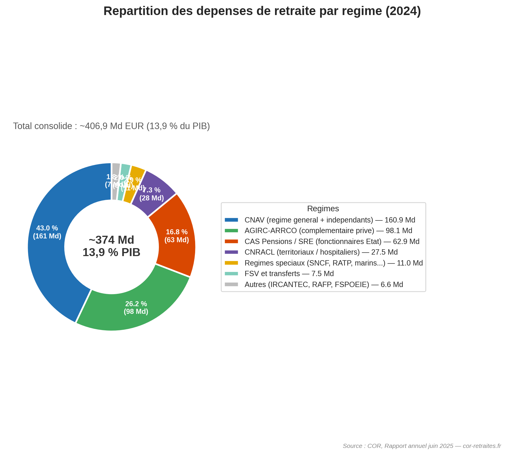
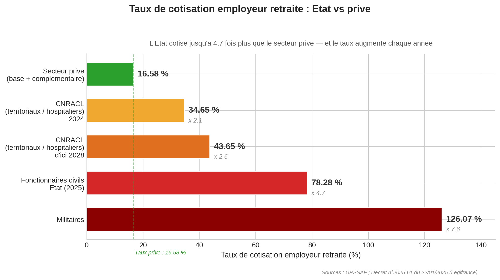
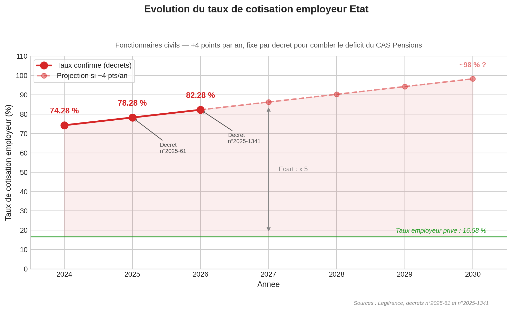
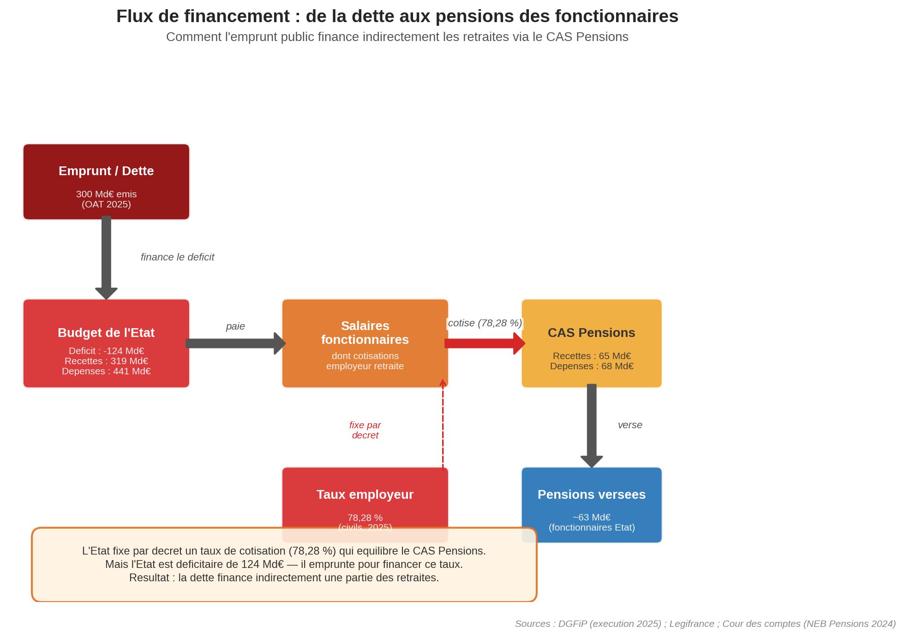
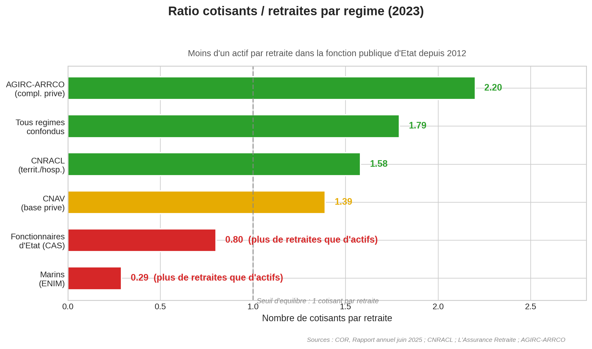

# Retraites en France : le vrai coût, les vrais chiffres

**Comment la France finance-t-elle 407 milliards d'euros de pensions par an — et pourquoi le système paraît "équilibré" alors qu'il ne l'est pas tout à fait ?**

*Juin 2026 — Données 2024-2025, sources officielles exclusivement*

---

## En bref

- Les retraites coûtent **407 milliards d'euros par an** en France, soit **13,9 % du PIB**. C'est le premier poste de dépense publique, et de très loin.
- Le COR (Conseil d'Orientation des Retraites) affiche un déficit de seulement **-1,7 milliard d'euros** et parle de "quasi-équilibre". Mais ce chiffre repose sur un mécanisme peu connu.
- L'État, en tant qu'employeur de fonctionnaires, cotise à un taux de **78,28 %** du traitement brut pour les retraites — contre **16,58 %** pour un employeur privé. Soit **4,7 fois plus**.
- Ce taux n'est pas calculé selon des règles actuarielles : il est fixé **chaque année par décret** pour combler exactement le trou du régime des fonctionnaires d'État.
- Comme l'État est lui-même déficitaire de 124 milliards d'euros, cet argent provient mécaniquement de l'emprunt — donc de la dette publique.
- Ce n'est pas un scandale. C'est un choix de société. Mais c'est un mécanisme que chaque citoyen devrait comprendre.

---

## La France, championne mondiale de la dépense publique

Avant de parler des retraites, il faut situer le cadre. En 2025, la France a dépensé environ **1 713 milliards d'euros** en dépenses publiques, soit **57,2 % de son PIB** ([INSEE, Informations Rapides n78, mars 2026](https://www.insee.fr/fr/statistiques/8956575)). C'est un record parmi les grandes économies. À titre de comparaison, la moyenne de la zone euro est autour de 49-50 % du PIB ([Banque de France, Bulletin n259/4](https://www.banque-france.fr/system/files/2025-07/BDF259-4_Depenses-publiques.pdf)).

Où va cet argent ? L'INSEE décompose les dépenses publiques par grande fonction ([INSEE Première n2093, février 2026](https://www.insee.fr/fr/statistiques/8735252)). Le premier poste, et de loin, c'est la **protection sociale** : **693 milliards d'euros**, soit **41 % de toute la dépense publique** et 23,6 % du PIB. La protection sociale, c'est les retraites, la maladie, la famille, le chômage, l'autonomie. Et dans cet ensemble, les retraites dominent.

---

## Combien coûtent les retraites ?

D'après le [rapport annuel du COR de juin 2025](https://www.cor-retraites.fr/rapports-du-cor/rapport-annuel-cor-juin-2025-evolutions-perspectives-retraites-france) (le COR est le Conseil d'Orientation des Retraites, l'organisme officiel rattaché au Premier ministre chargé de suivre le système), les dépenses totales de retraite en France s'élèvent à environ **406,9 milliards d'euros en 2024, soit 13,9 % du PIB**.

Pour donner un ordre de grandeur : c'est plus que le budget total de l'Éducation nationale, de la Défense et de la Justice réunis. C'est davantage que l'ensemble des recettes de l'impôt sur le revenu et de l'impôt sur les sociétés combinés.

Voici la répartition entre les grands régimes :

| Régime | Dépenses 2024 | Source |
|:-------|:-------------|:-------|
| CNAV (régime général des salariés du privé + indépendants) | ~160,9 Md | [COR rapport annuel 2025](https://www.cor-retraites.fr/rapports-du-cor/rapport-annuel-cor-juin-2025-evolutions-perspectives-retraites-france) |
| AGIRC-ARRCO (complémentaire obligatoire du privé) | 98,1 Md | [COR rapport annuel 2025](https://www.cor-retraites.fr/rapports-du-cor/rapport-annuel-cor-juin-2025-evolutions-perspectives-retraites-france) |
| Fonctionnaires d'État (CAS Pensions) | 62,9 Md | [Cour des comptes, NEB Pensions 2024](https://www.ccomptes.fr/sites/default/files/2025-04/NEB-2024-Pensions_0.pdf) |
| CNRACL (fonctionnaires territoriaux et hospitaliers) | 27,5 Md | [COR rapport annuel 2025](https://www.cor-retraites.fr/rapports-du-cor/rapport-annuel-cor-juin-2025-evolutions-perspectives-retraites-france) |
| Autres (IRCANTEC, RAFP, régimes spéciaux SNCF/RATP, etc.) | ~17-18 Md | [COR](https://www.cor-retraites.fr/rapports-du-cor/rapport-annuel-cor-juin-2025-evolutions-perspectives-retraites-france), [Sénat](https://www.senat.fr/rap/l24-144-325/l24-144-32516.html) |
| FSV et transferts | ~7-8 Md | [COR rapport annuel 2025](https://www.cor-retraites.fr/rapports-du-cor/rapport-annuel-cor-juin-2025-evolutions-perspectives-retraites-france) |
| **Total consolidé** | **~407 Md (13,9 % PIB)** | [COR rapport annuel 2025](https://www.cor-retraites.fr/rapports-du-cor/rapport-annuel-cor-juin-2025-evolutions-perspectives-retraites-france) |

La DREES (Direction de la Recherche, des Études, de l'Évaluation et des Statistiques, le service statistique des ministères sociaux) donne un chiffre légèrement différent pour 2023 — **369,9 milliards d'euros, soit 13,1 % du PIB** — car son périmètre de comptage diffère légèrement ([DREES, Les retraités et les retraites, édition 2025](https://drees.solidarites-sante.gouv.fr/publications-communique-de-presse-documents-de-reference/250731_PANORAMAS-retraites)). Quel que soit le périmètre exact, l'ordre de grandeur est le même : environ un euro sur sept produits en France va aux retraites.

---

## D'où vient l'argent ?

Un système de retraite par répartition, comme celui de la France, fonctionne sur un principe simple : les actifs d'aujourd'hui paient les pensions des retraités d'aujourd'hui. Mais d'où viennent concrètement les ressources ?

Le COR et la DREES identifient plusieurs sources de financement ([COR rapport annuel 2025](https://www.cor-retraites.fr/rapports-du-cor/rapport-annuel-cor-juin-2025-evolutions-perspectives-retraites-france)) :

- **Les cotisations sociales** (salariales + patronales) : environ **66 % des ressources totales**. C'est le cœur du système par répartition. Salariés et employeurs cotisent chaque mois sur les salaires.
- **La CSG** (Contribution Sociale Généralisée) : un prélèvement de 9,2 % sur les revenus d'activité, dont une fraction est affectée à la branche vieillesse et au FSV (Fonds de Solidarité Vieillesse, qui finance les droits à la retraite non liés à des cotisations, comme les périodes de chômage ou le minimum vieillesse).
- **Des impôts et taxes affectés** : notamment une part de TVA, transférée à la sécurité sociale pour compenser les exonérations de cotisations patronales sur les bas salaires.
- **Les contributions de l'État employeur** : c'est ici que les choses deviennent intéressantes.

---

## Le COR dit que le système est "quasi-équilibré". Vraiment ?

Le COR publie chaque année un diagnostic sur l'équilibre financier du système de retraite. Dans son [rapport annuel de juin 2025](https://www.cor-retraites.fr/rapports-du-cor/rapport-annuel-cor-juin-2025-evolutions-perspectives-retraites-france), le verdict est plutôt rassurant : un déficit de seulement **-1,7 milliard d'euros en 2024**, soit -0,1 % du PIB. "Quasi-équilibre" ([COR, synthèse juin 2025, PDF](https://www.cor-retraites.fr/sites/default/files/2025-06/Synth%C3%A8se_Def_.pdf)).

Moins 1,7 milliard, sur 407 milliards de dépenses, c'est effectivement un écart infime. Mais ce chiffre mérite qu'on regarde sous le capot.

Pour comprendre pourquoi ce "quasi-équilibre" est trompeur, il faut s'intéresser à un mécanisme budgétaire méconnu : le **CAS Pensions**.

---

## Le CAS Pensions : un mécanisme qui change tout

Le CAS Pensions (Compte d'Affectation Spéciale "Pensions") est le véhicule budgétaire qui finance les retraites des **fonctionnaires civils et militaires de l'État** — enseignants, policiers, militaires, magistrats, agents des ministères. En 2024, ses dépenses se sont élevées à **68,2 milliards d'euros** pour des recettes de **64,7 milliards d'euros**, soit un déficit de **-3,5 milliards d'euros** ([Cour des comptes, Note d'Exécution Budgétaire CAS Pensions 2024](https://www.ccomptes.fr/sites/default/files/2025-04/NEB-2024-Pensions_0.pdf)).

D'où viennent les recettes du CAS Pensions ? Principalement des "cotisations" que l'État, en tant qu'employeur, verse pour ses fonctionnaires. Et c'est là que le mécanisme devient remarquable.

### L'écart de cotisation : 78 % vs 17 %

Dans le secteur privé, un employeur paie environ **16,58 %** du salaire brut en cotisations retraite (base + complémentaire AGIRC-ARRCO). Le salarié paie de son côté environ 11 %. Total : environ 28 % ([URSSAF](https://www.urssaf.fr/)).

Pour un fonctionnaire civil de l'État, le salarié paie à peu près la même chose (11,10 %). Mais l'État employeur paie... **78,28 %** du traitement brut. Pour les militaires, c'est encore plus : **126,07 %** ([Décret n2025-61 du 22 janvier 2025](https://www.legifrance.gouv.fr/jorf/id/JORFTEXT000051020776)).

Autrement dit, pour chaque euro de traitement versé à un fonctionnaire civil, l'État verse en plus 78 centimes au CAS Pensions. Pour un militaire, c'est 1,26 euro. Côté privé, l'employeur verse 17 centimes.

Le taux employeur de l'État est donc **4,7 fois supérieur** à celui du secteur privé.

### Ce taux n'est pas actuariel : c'est une variable d'ajustement

C'est le point crucial. Dans le secteur privé, les taux de cotisation retraite sont fixés par la loi ou par des accords entre partenaires sociaux (pour AGIRC-ARRCO). Ils ne bougent que rarement.

Pour les fonctionnaires d'État, le taux de cotisation employeur est fixé **chaque année par décret du gouvernement**. Et il est explicitement calibré pour couvrir les dépenses du CAS Pensions. Ce n'est pas un taux calculé selon des principes actuariels (combien faut-il mettre de côté pour financer les droits acquis) : c'est le chiffre qu'il faut atteindre pour que les recettes du CAS couvrent ses dépenses.

On peut le voir dans la trajectoire récente :

| Année | Taux employeur État (civils) | Texte |
|:------|:----------------------------|:------|
| Jusqu'à fin 2024 | 74,28 % | Historique |
| 1er janvier 2025 | **78,28 %** (+4 pts) | [Décret n2025-61 du 22/01/2025](https://www.legifrance.gouv.fr/jorf/id/JORFTEXT000051020776) |
| 1er janvier 2026 | **82,28 %** (+4 pts) | [Décret n2025-1341 du 26/12/2025](https://www.legifrance.gouv.fr/jorf/id/JORFTEXT000053175170) |

Le schéma est limpide : +4 points par an, par décret, pour combler un trou qui se creuse mécaniquement (plus de retraités, moins d'actifs cotisants, revalorisation des pensions). La Cour des comptes le confirme : le CAS Pensions est "quasi-équilibré par construction" ([NEB Pensions 2024](https://www.ccomptes.fr/sites/default/files/2025-04/NEB-2024-Pensions_0.pdf)). Par construction, pas par vertu.

---

## La chaîne logique : quand la dette finance les retraites

Maintenant, assemblons les pièces du puzzle.

**Première pièce : l'État est structurellement déficitaire.** En 2025, le déficit budgétaire de l'État est de **-124,2 milliards d'euros** ([DGFiP, Situation mensuelle budgétaire, décembre 2025](https://www.economie.gouv.fr/files/files/directions_services/dgfip/media-document/sme_2025-12_definitive.pdf)). L'État dépense chaque année bien plus qu'il ne collecte en impôts. La différence est financée par l'emprunt : en 2025, l'AFT (Agence France Trésor) a émis **300 milliards d'euros** de dette à moyen et long terme ([AFT, communiqué décembre 2024](https://www.aft.gouv.fr/en/publications/communiques-presse/19-december-2024-indicative-state-financing-programme-2025)).

**Deuxième pièce : les salaires des fonctionnaires sont une dépense budgétaire.** L'État paie les traitements de ses agents. Parmi ces dépenses, il y a la "cotisation employeur" au CAS Pensions — ces fameux 78,28 %.

**Troisième pièce : ces cotisations ne sont pas de l'argent "épargné" ou "mis de côté".** Elles transitent par le budget de l'État. L'État les inscrit comme une dépense (cotisations employeur) et comme une recette du CAS Pensions. Le CAS verse ensuite les pensions. C'est un jeu d'écritures internes au budget de l'État.

**Conclusion logique :** Puisque l'État est déficitaire, chaque euro dépensé au-delà de ses recettes est un euro emprunté. Les cotisations retraite que l'État verse au CAS Pensions sont des dépenses comme les autres. Elles sont donc partiellement financées par l'emprunt. Et l'emprunt, c'est de la dette.

Pour le dire avec une image : c'est comme si une entreprise déficitaire augmentait chaque année la cotisation retraite qu'elle verse pour ses salariés, en empruntant l'argent nécessaire. Le système de retraite de ses salariés paraîtrait "en équilibre" — mais c'est la dette de l'entreprise qui financerait cet équilibre.

---

## Combien pèse cette subvention implicite ?

Quantifier exactement la "subvention" de l'État au système de retraite via le CAS Pensions dépend d'un choix de méthode : quel taux de référence utilise-t-on pour comparer ?

Les composantes individuelles sont documentées par les sources officielles :

| Composante | Ordre de grandeur | Source |
|:-----------|:-----------------|:-------|
| Surcotisation employeur État au CAS (écart entre le taux réel et un taux "normal") | Selon le taux de référence choisi | [Cour des comptes NEB 2024](https://www.ccomptes.fr/sites/default/files/2025-04/NEB-2024-Pensions_0.pdf), [Légifrance](https://www.legifrance.gouv.fr/jorf/id/JORFTEXT000051020776) |
| Subventions de l'État aux régimes spéciaux (SNCF, RATP, marins...) | ~5,9 Md | [Sénat, rapport PLF 2025](https://www.senat.fr/rap/l24-144-325/l24-144-32516.html) |
| Déficit CNRACL (fonctionnaires territoriaux et hospitaliers) | -3,7 Md (2024) | [CCSS](https://www.securite-sociale.fr/home/medias/presse/list-presse/le-solde-des-comptes-de-la-securite-sociale-s-etablit-a-21-6-md-en-2025.html) |
| Impôts affectés et transferts inter-branches | 16-20 Md | [COR rapport 2025](https://www.cor-retraites.fr/rapports-du-cor/rapport-annuel-cor-juin-2025-evolutions-perspectives-retraites-france) |

Le COR lui-même reconnaît que son diagnostic d'équilibre dépend fortement de la **convention comptable** retenue. Dans son annexe méthodologique, il distingue deux approches — appelées EPR et EEC — qui produisent des résultats significativement différents ([COR, annexe méthodologique, PDF](https://www.cor-retraites.fr/sites/default/files/2025-06/M%C3%A9thodologie_RA.pdf)). Le "quasi-équilibre" de -1,7 milliard correspond à la convention EPR. Avec la convention alternative, le déficit serait plus marqué.

La Cour des comptes, dans sa [mission flash de février 2025 sur la situation financière du système de retraites](https://www.ccomptes.fr/sites/default/files/2025-02/20250220-Situation-financiere-et-perspectives-du-systeme-de%20retraites_0.pdf), estime les dépenses de retraites à **388,4 milliards d'euros** (données 2022-2023) et pointe les limites de la comptabilisation actuelle.

---

## Pourquoi ce taux est-il si élevé ? Les nuances nécessaires

À ce stade, une question légitime se pose : pourquoi l'État accepte-t-il de payer un taux aussi élevé ? Est-ce une anomalie, un privilège, un choix délibéré ?

Plusieurs éléments de contexte sont indispensables pour ne pas tomber dans la caricature.

### Les fonctionnaires gagnent moins en salaire net

Les fonctionnaires d'État ont historiquement des rémunérations nettes plus basses que le secteur privé à qualification équivalente, surtout pour les cadres. Le point d'indice de la fonction publique a été gelé pendant de longues années (il n'a augmenté que de 3,5 % en cumulé entre 2010 et 2023).

### Les pensions ne sont pas plus généreuses

Contrairement à une idée reçue, les pensions des fonctionnaires ne sont pas forcément meilleures. Le mode de calcul est différent — 75 % des 6 derniers mois de traitement indiciaire, contre 50 % des 25 meilleures années dans le privé — mais les primes (souvent 20 à 40 % de la rémunération totale) sont **exclues** du calcul de la pension. Résultat : la pension moyenne brute tous régimes confondus est de **1 666 euros par mois** ([DREES, édition 2025](https://drees.solidarites-sante.gouv.fr/publications-communique-de-presse-documents-de-reference/250731_PANORAMAS-retraites)), et les simulations de la DREES montrent qu'appliquer les règles du privé aux fonctionnaires modifierait la pension moyenne de moins de 1,5 %.

Le taux de cotisation employeur de 78 % ne finance donc pas des pensions "meilleures" — il compense un **déséquilibre démographique**.

### Le vrai problème : la démographie

Le ratio cotisants/retraités — le nombre d'actifs qui cotisent pour chaque retraité — varie énormément selon les régimes :

| Régime | Cotisants | Retraités | Ratio | Source |
|:-------|:---------|:----------|:------|:-------|
| AGIRC-ARRCO (complémentaire privé) | 20,0 M | 12,6 M | **2,2** | [COR, fiche AGIRC-ARRCO 2024](https://www.cor-retraites.fr/sites/default/files/2024-07/Fiche_AGIRC_ARRCO_vf.pdf) |
| Tous régimes confondus | 30,4 M | 17,2 M | **1,79** | [COR rapport annuel 2025](https://www.cor-retraites.fr/rapports-du-cor/rapport-annuel-cor-juin-2025-evolutions-perspectives-retraites-france) |
| CNRACL (territoriaux/hospitaliers) | 2,2 M | 1,6 M | **1,58** | [CNRACL chiffres clés 2023](https://www.cnracl.retraites.fr/nous-connaitre/presse/chiffres-cles/chiffres-cles-2023) |
| CNAV (base privé) | 22,3 M | 15,1 M | **1,39** | [L'Assurance Retraite 2023](https://www.lassuranceretraite.fr/portail-info/nous-connaitre/chiffres-cles.html) |
| **Fonctionnaires d'État (CAS)** | **2,0 M** | **2,5 M** | **< 0,8** | [COR 2025](https://www.cor-retraites.fr/rapports-du-cor/rapport-annuel-cor-juin-2025-evolutions-perspectives-retraites-france), [Sénat PLF 2025](https://www.senat.fr/rap/l24-144-325/l24-144-3253.html) |
| Marins (ENIM) | — | — | **0,29** | [COR rapport annuel 2025](https://www.cor-retraites.fr/rapports-du-cor/rapport-annuel-cor-juin-2025-evolutions-perspectives-retraites-france) |

Quand le ratio est supérieur à 1, le régime peut en théorie s'autofinancer par les cotisations. Quand il passe sous 1 — comme c'est le cas pour les fonctionnaires d'État depuis 2012 — il y a **plus de retraités que d'actifs**. Le trou ne peut être comblé que par une subvention extérieure. C'est exactement ce que fait le CAS Pensions avec son taux à 78 %.

### Un choix de société, pas un accident

Le système de retraite des fonctionnaires d'État n'a jamais été un régime par répartition classique au sens du secteur privé. L'État n'a jamais "mis de côté" de réserves. Les pensions des fonctionnaires sont une **dépense budgétaire directe de l'État**, assumée depuis les origines. Le CAS Pensions, créé seulement en 2006, n'a fait que rendre cette dépense plus lisible comptablement — pas changer sa nature.

### La CNRACL, historiquement ponctionneuse puis ponctionnée

La CNRACL (Caisse Nationale de Retraites des Agents des Collectivités Locales), le régime des fonctionnaires territoriaux et hospitaliers, a longtemps été excédentaire. Pendant des décennies, environ 100 milliards d'euros (en euros constants) ont été prélevés sur ses réserves via un mécanisme de "compensation démographique" pour financer d'autres régimes déficitaires. Aujourd'hui, la CNRACL est elle-même en déficit (-3,7 milliards en 2024) — une situation dont elle est en partie victime ([CCSS, rapports 2025](https://www.securite-sociale.fr/files/live/sites/SSFR/files/medias/CCSS/2025/Rapport%20CCSS%20juin_BAT_%20avec%20couverture.pdf)).

### Le privé n'est pas purement contributif non plus

Il serait inexact de présenter le secteur privé comme un modèle de pureté contributive. Le FSV (Fonds de Solidarité Vieillesse), financé par la CSG — un impôt, pas une cotisation — prend en charge des droits à la retraite non liés à des cotisations (périodes de chômage, minimum vieillesse). L'AGIRC-ARRCO (la complémentaire du privé) bénéficie d'avantages fiscaux. Des transferts de TVA compensent les exonérations de cotisations. Le financement des retraites est, dans tous les régimes, un mélange de cotisations, d'impôts et de transferts.

---

## La vraie question : la transparence

Le problème n'est pas que l'État finance les retraites de ses fonctionnaires. Après tout, il finance aussi leurs salaires, leur formation, leurs locaux de travail. C'est un employeur.

Le problème est que ce financement est **opaque**. Quand le COR annonce que le système de retraites est "quasi-équilibré", le citoyen comprend que le système tourne à peu près tout seul, sur ses propres ressources. C'est formellement vrai — les cotisations rentrent et les pensions sortent. Mais c'est substantiellement trompeur, parce que le principal cotisant (l'État employeur) fixe lui-même le montant de sa cotisation, par décret, sans limite de plafond, et finance cette cotisation par l'emprunt puisqu'il est déficitaire.

Le COR lui-même reconnaît cette ambiguïté dans son [annexe méthodologique](https://www.cor-retraites.fr/sites/default/files/2025-06/M%C3%A9thodologie_RA.pdf), en signalant que le choix entre ses deux conventions comptables (EPR et EEC) "change fondamentalement le diagnostic" sur l'équilibre du système.

La Cour des comptes est plus directe. Elle qualifie la cotisation employeur de l'État au CAS de ["subvention d'équilibre de facto"](https://www.ccomptes.fr/sites/default/files/2025-04/NEB-2024-Pensions_0.pdf). En d'autres termes : l'équilibre est garanti parce que l'État décide qu'il le sera, quel qu'en soit le coût.

---

## Et la dette dans tout ça ?

La dette publique française atteint **3 460,5 milliards d'euros fin 2025, soit 115,6 % du PIB** ([INSEE, Informations Rapides n78](https://www.insee.fr/fr/statistiques/8956575)). Elle a augmenté de plus de **1 000 milliards d'euros en six ans** (2 380 milliards fin 2019, avant le COVID).

La charge de la dette — ce que l'État paie en intérêts — s'élève à environ **53,5 milliards d'euros** dans le budget de l'État en 2025 ([budget.gouv.fr](https://www.budget.gouv.fr/documentation/documents-budgetaires/exercice-2025/projet-loi-finances-les/budget-general-plf-2025/engagements-financiers-letat)), et **67 milliards d'euros** pour l'ensemble des administrations publiques selon le HCFP (Haut Conseil des Finances Publiques) ([HCFP, avis n2025-1](https://www.hcfp.fr/sites/default/files/2025-01/Avis%20PLF_PFSS_2025_amend%C3%A9s.pdf)).

Un chiffre qui donne le vertige : une hausse de 1 point des taux d'intérêt coûte **3,2 milliards d'euros dès la première année**, et **32,6 milliards d'euros au bout de neuf ans** ([AFT, communiqué octobre 2025](https://www.aft.gouv.fr/en/publications/communiques-presse/14-october-2025-french-state-funding-2026-and-update-2025)).

Évidemment, il serait faux de dire que "les retraites créent la dette". Le déficit de l'État a de multiples causes. Mais il est tout aussi faux de dire que les retraites n'y contribuent pas. Les cotisations employeur au CAS Pensions — environ 60-65 milliards par an — sont une dépense budgétaire de l'État, dans un budget qui est déficitaire de 124 milliards. L'argent est **fongible** : on ne peut pas dire que tel euro de recette finance tel euro de dépense. Mais mécaniquement, une partie du financement des retraites publiques passe par l'emprunt.

---

## Et demain ?

Le système fait face à un défi démographique majeur : le ratio cotisants/retraités se dégrade. En 2004, on comptait 2,0 actifs cotisants pour 1 retraité. En 2024, ce ratio est tombé à 1,7. Les projections du COR montrent qu'il continuera de baisser ([COR rapport annuel 2025](https://www.cor-retraites.fr/rapports-du-cor/rapport-annuel-cor-juin-2025-evolutions-perspectives-retraites-france)).

La réforme de 2023 (report de l'âge légal à 64 ans) a amélioré les projections à moyen terme, mais n'a pas résolu le problème structurel : si le taux de cotisation employeur État continue d'augmenter de 4 points par an, il atteindra **90 %** vers 2028 et **100 %** autour de 2030. L'État verserait alors autant en cotisations retraite qu'en salaire — pour chaque euro de traitement, un euro de cotisation.

La sécurité sociale dans son ensemble est dans une trajectoire préoccupante : son déficit a atteint **-21,6 milliards d'euros** en 2025, doublant en seulement deux ans (-10,8 milliards en 2023). C'est le pire solde hors COVID depuis 2012 ([CCSS, communiqué mai 2026](https://www.securite-sociale.fr/home/medias/presse/list-presse/le-solde-des-comptes-de-la-securite-sociale-s-etablit-a-21-6-md-en-2025.html)).

---

## Conclusion

Les retraites en France ne sont pas un système en faillite. Les pensions sont versées, les droits sont respectés, le système fonctionne. Mais l'affirmation selon laquelle il est "équilibré" repose sur un mécanisme de financement circulaire :

1. L'État fixe par décret un taux de cotisation qui comble exactement le trou.
2. L'État finance cette cotisation par son budget général, qui est déficitaire.
3. L'État finance son déficit par l'emprunt, c'est-à-dire par la dette.

Ce n'est ni un scandale ni un secret d'État. Les textes sont publics — les décrets de Légifrance, les rapports de la Cour des comptes, les données du COR. Mais c'est un mécanisme que le grand public ignore largement, et que la communication institutionnelle n'éclaire pas.

Les chiffres sont ce qu'ils sont : **407 milliards d'euros de pensions par an**, un taux de cotisation employeur État de **78,28 % en route vers 82,28 %**, un déficit budgétaire de **124 milliards** financé par la dette. Chaque citoyen est libre de considérer que c'est un bon système, un mauvais système, ou un système à réformer. Mais il devrait au moins savoir comment il fonctionne.

---

## Sources

Toutes les sources citées dans cet article sont des institutions publiques françaises ou européennes :

- **COR** — [Rapport annuel juin 2025](https://www.cor-retraites.fr/rapports-du-cor/rapport-annuel-cor-juin-2025-evolutions-perspectives-retraites-france) | [Synthèse PDF](https://www.cor-retraites.fr/sites/default/files/2025-06/Synth%C3%A8se_Def_.pdf) | [Annexe méthodologique PDF](https://www.cor-retraites.fr/sites/default/files/2025-06/M%C3%A9thodologie_RA.pdf) | [Rapport complet PDF](https://www.cor-retraites.fr/sites/default/files/2025-06/RA_2025_def_publi.pdf)
- **Cour des comptes** — [NEB CAS Pensions 2024 PDF](https://www.ccomptes.fr/sites/default/files/2025-04/NEB-2024-Pensions_0.pdf) | [Mission flash retraites, février 2025 PDF](https://www.ccomptes.fr/sites/default/files/2025-02/20250220-Situation-financiere-et-perspectives-du-systeme-de%20retraites_0.pdf)
- **Légifrance** — [Décret n2025-61, taux 78,28 %](https://www.legifrance.gouv.fr/jorf/id/JORFTEXT000051020776) | [Décret n2025-1341, taux 82,28 %](https://www.legifrance.gouv.fr/jorf/id/JORFTEXT000053175170)
- **INSEE** — [Première n2054, comptes APU 2024](https://www.insee.fr/fr/statistiques/8574492) | [IR n78, déficit 2025](https://www.insee.fr/fr/statistiques/8956575) | [Première n2093, dépenses COFOG 2024](https://www.insee.fr/fr/statistiques/8735252)
- **DREES** — [Les retraités et les retraites, édition 2025](https://drees.solidarites-sante.gouv.fr/publications-communique-de-presse-documents-de-reference/250731_PANORAMAS-retraites)
- **DGFiP** — [Situation mensuelle budgétaire, décembre 2025 PDF](https://www.economie.gouv.fr/files/files/directions_services/dgfip/media-document/sme_2025-12_definitive.pdf)
- **CCSS** — [Communiqué solde sécu 2025](https://www.securite-sociale.fr/home/medias/presse/list-presse/le-solde-des-comptes-de-la-securite-sociale-s-etablit-a-21-6-md-en-2025.html) | [Rapport juin 2025 PDF](https://www.securite-sociale.fr/files/live/sites/SSFR/files/medias/CCSS/2025/Rapport%20CCSS%20juin_BAT_%20avec%20couverture.pdf)
- **budget.gouv.fr** — [Chiffres clés 2025](https://www.budget.gouv.fr/reperes/budget/articles/chiffres-cles-budget-etat-2025) | [PAP CAS Pensions PDF](https://www.budget.gouv.fr/documentation/file-download/27689) | [Mission Engagements financiers](https://www.budget.gouv.fr/documentation/documents-budgetaires/exercice-2025/projet-loi-finances-les/budget-general-plf-2025/engagements-financiers-letat)
- **Sénat** — [Rapport régimes sociaux et de retraite, PLF 2025](https://www.senat.fr/rap/l24-144-325/l24-144-32516.html) | [Avis CAS Pensions PLF 2025](https://www.senat.fr/rap/a24-147-3/a24-147-3_mono.html)
- **AFT** — [Programme financement 2025](https://www.aft.gouv.fr/en/publications/communiques-presse/19-december-2024-indicative-state-financing-programme-2025) | [Mise à jour 2025 et programme 2026](https://www.aft.gouv.fr/en/publications/communiques-presse/14-october-2025-french-state-funding-2026-and-update-2025)
- **retraitesdeletat.gouv.fr** — [Statistiques CAS Pensions](https://retraitesdeletat.gouv.fr/statistiques/cas.html)
- **HCFP** — [Avis n2025-1 PDF](https://www.hcfp.fr/sites/default/files/2025-01/Avis%20PLF_PFSS_2025_amend%C3%A9s.pdf)
- **Banque de France** — [Bulletin n259/4, comparaison zone euro PDF](https://www.banque-france.fr/system/files/2025-07/BDF259-4_Depenses-publiques.pdf)
- **URSSAF** — [urssaf.fr](https://www.urssaf.fr/)
